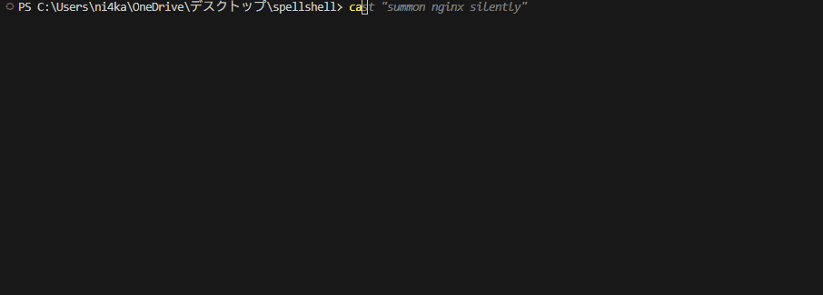

# SpellShell 🧙‍♂️

*A terminal where you cast spells instead of typing commands.*

> **What if the terminal felt like writing poetry?**  
> SpellShell turns commands into spells — expressive, readable, and powerful.  
> This is the beginning of a new era in human-computer interaction.

---

## ✨ What is SpellShell?

SpellShell is a magical terminal interface where traditional shell commands are replaced with intuitive, fantasy-inspired spells.



No more `nginx -g daemon off`. Just say:

```bash
cast "summon nginx silently"
```

And watch the magic happen.

---

## 🔮 Vision: A New Kind of Terminal

The command line is one of the most powerful interfaces ever created —  
but it hasn't evolved in decades.

SpellShell reimagines the terminal not as a tool, but as a **language for creation**,  
as expressive and readable as a story.

Our goal:  
- Replace cryptic syntax with intuitive spellcasting  
- Turn automation into art  
- Build a community where every developer can craft their own spells

This is not just a CLI.  
It's **an incantation layer for computing.**

---

## 📖 SpellScript (v0.1 Draft)

A simple, readable scripting language designed for humans and wizards alike:

```spell
summon nginx silently
cloak api-key from output

while true:
  divine crash logs
```

SpellScript is a DSL (domain-specific language) designed to be expressive, whimsical, and just powerful enough to automate your dev life.

---

## 🔧 Installation (Coming Soon)

```bash
npm install -g spellshell
spellshell
```

---

## 🔬 SpellShell is more than a CLI

- 🔗 Integrates with real shell tools and APIs (via plugins)
- 🧠 SpellScript: a domain-specific language for automation as narrative
- 🤖 AI-enhanced commands (natural language, crash analysis, smart suggestions)
- 🧙‍♀️ Visual Spell Editor for non-technical users
- 🌍 Spellbook.dev: a marketplace of reusable, community-powered spells

---

## 🧩 Features (Roadmap)

- [x] Basic spell parsing
- [ ] Plugin system (`npm install spell-aws`, `spell-git`, etc.)
- [ ] AI-integrated spells (e.g. `divine crash logs` using GPT)
- [ ] Visual Spell Editor (GUI for crafting custom spells)
- [ ] Public spellbook: community-contributed spells

---

## 🧪 Examples of Spells

```bash
cast "summon nginx silently"
cast "banish logs for 3 days"
cast "cloak api-key from output"
cast "teleport repo to github"
cast "divine crash logs"
```

---

## 🚀 Follow the Journey

- Follow [@structax](https://x.com/structax) on X for updates
- Star the repo to show support
- Join the spellcraft: spell ideas, issues, or pull requests welcome!

---

## ✨ License

MIT

---

> Magic is just well-written code. Now it looks like it, too.  
> If that excites you, follow the journey, join the guild, or cast a pull request.